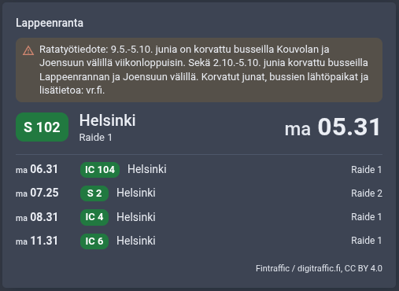
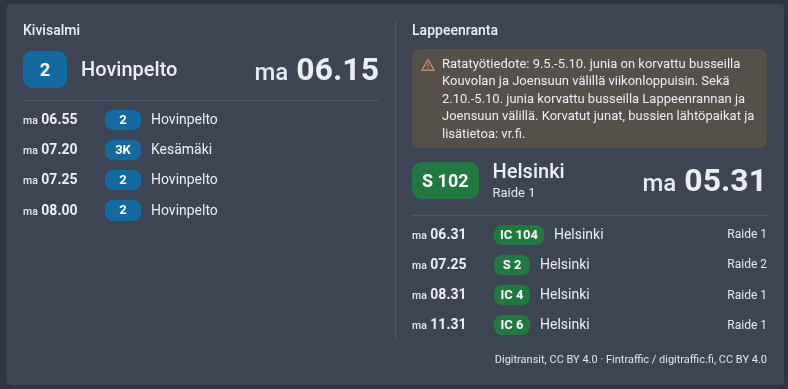

# Departures card

Home Assistant dashboard card for the next departures from bus stops and railway stations, from any sensor in the
departures format.

[![GitHub Release][releases-shield]][releases] [![GitHub Release Date][release-date-shield]][releases]

[![HACS][hacs-shield]][hacs] [![Home Assistant][home-assistant-shield]][home-assistant] [![License][license-shield]](LICENSE)

![Project Maintenance][maintenance-shield] [![GitHub Activity][commits-shield]][commits] [![Open bugs][bugs-shield]][bugs] [![Open enhancements][enhancements-shield]][enhancements]

## Support

Hey dude! Help me out for a couple of :beers: or a :coffee:!

[](https://www.buymeacoffee.com/jesmak)

## What is it?



A custom card that shows when the next bus, tram or train leaves. Each stop is a section of its own: the next
departure large, with its line, destination and a countdown, and the ones after it as rows below. Several stops fit
in one card, such as both sides of a street, and they sit side by side when the card is wide enough.



The card reads sensors in the [departures format](docs/departures-format.md), so it works with any integration that
writes it:

- [Digitransit Live](https://github.com/jesmak/digitransit_live): bus, tram and metro stops anywhere in Finland.
- [Digitraffic Live](https://github.com/jesmak/digitraffic_live): Finnish railway stations, optionally only the
  trains that stop at another station later, such as Helsinki → Tampere.

Integrations that write the format carry the GitHub topic
[`departures-card-source`](https://github.com/topics/departures-card-source), so that's where to look for more. If
you make one, give its repository the topic too. A template entity can write the format as well.

## Options

| Name             | Type    | Default  | Description                                                                        |
| ---------------- | ------- | -------- | ---------------------------------------------------------------------------------- |
| `type`           | string  | required | `custom:departures-card`                                                           |
| `entities`       | list    | required | Departures sensors, each shown as a section: an entity id, or one with its heading |
| `title`          | string  |          | Shown at the top of the card                                                       |
| `departures`     | number  | `4`      | How many departures each stop shows, the large one included                        |
| `show_cancelled` | boolean | `true`   | Show cancelled departures, struck through with the reason                          |
| `show_notices`   | boolean | `true`   | Show the stop's notices, such as track works, under its name                       |

Each item of `entities` is an entity id, or an object with these keys:

| Name       | Type   | Description                                                            |
| ---------- | ------ | ---------------------------------------------------------------------- |
| `entity`   | string | The departures sensor                                                  |
| `name`     | string | Replaces the stop's own name. Both sides of a street usually share one |
| `subtitle` | string | A quieter second part of the heading, such as the direction            |

Everything can be set in the card's visual editor.

### One stop

```yaml
type: custom:departures-card
entities:
  - sensor.kauppatori_h0453
```

### Both sides of a street

```yaml
type: custom:departures-card
title: Next buses
departures: 5
entities:
  - entity: sensor.mannerheimintie_h1234
    name: Mannerheimintie
    subtitle: towards the centre
  - entity: sensor.mannerheimintie_h1235
    name: Mannerheimintie
    subtitle: away from the centre
```

### Trains both ways between two cities

Two Digitraffic Live station departure sensors, one in each direction with the other city as its "stops at" station:

```yaml
type: custom:departures-card
entities:
  - entity: sensor.trains_helsinki_tampere
    subtitle: to Tampere
  - entity: sensor.trains_tampere_helsinki
    subtitle: to Helsinki
```

## What a departure shows

- **How soon it leaves:** "now" under a minute, minutes under an hour, and the clock time after that. A time that
  isn't today has its weekday in front ("Mon 06:15"), and one more than a week away its date. The countdown runs on
  between the sensor's updates, and a departure more than a minute gone is hidden.
- **Live times:** a departure tracked in real time has a live icon. When it is late or early, its timetable time is
  struck through next to the estimate, with the difference in minutes.
- **The line's colour**, when the integration gives one, otherwise a colour by vehicle type.
- **Track or platform:** a train's track, or another vehicle's platform, when the stop has them.
- **Cancellations:** a cancelled departure stays in the list, greyed and struck through, with the reason when the
  integration gives one. It is never the large one: that is always the next departure you can actually take.
- **Notices:** a notice about the departure itself, such as "Passengers are directed to train S 106", and the stop's
  own notices, such as track works with buses replacing trains, shown in full under its name.

Clicking a stop's name opens its sensor.

## Colours

The vehicle types' colours can be changed in a theme:

| Variable                   | Default   |
| -------------------------- | --------- |
| `--departures-bus-color`   | `#0b6aa2` |
| `--departures-tram-color`  | `#00845a` |
| `--departures-metro-color` | `#d9480f` |
| `--departures-train-color` | `#1b7a3e` |
| `--departures-ferry-color` | `#00639a` |
| `--departures-other-color` | `#5f6b76` |

## How to install

### With HACS

1. Add this repository to HACS custom repositories with type **Dashboard**
2. Search for Departures card in HACS and download it
3. Refresh your browser

### Manually

1. Take `dist/departures-card.js` from the source code of the [latest release][releases] and copy it to the
   `config/www` folder of your Home Assistant installation
2. In Home Assistant settings, open dashboards, click the three dots at the top right and open resources
3. Add a new resource with the path `/local/departures-card.js` and type JavaScript
4. Refresh your browser

## Writing the format

The [departures format](docs/departures-format.md) describes the sensor the card reads: its attributes, each
departure's fields, how the card shows them, and the rules for sources. An integration that writes it gets the card
for free, and the format is meant to stay stable: new optional fields are added without changing its version.

## Translating

The card's texts are in `src/localize/languages/`, one JSON file per language, named by its language code: `en.json`,
`fi.json`. To add a language, copy `en.json` to the new language's code, such as `sv.json`, and translate the values.
Nothing else needs changing: the card finds the file by itself and uses it when Home Assistant is set to that
language. A text left out falls back to English. Names, destinations and notices come from the integrations, in the
language they were set up with.

## Development

Requires Node 22.13 or newer.

```
npm install
npm run check
```

`npm run check` typechecks, lints, checks formatting, runs the tests and builds `dist/departures-card.js`, which is
the file HACS installs and is committed to the repository.

| Path                        | What it contains                                           |
| --------------------------- | ---------------------------------------------------------- |
| `src/departures-card.ts`    | The card itself                                            |
| `src/editor.ts`             | The visual editor                                          |
| `src/departures.ts`         | Reading the sensors, and the times, days and colours shown |
| `src/localize/languages/`   | The card's texts, one JSON file per language               |
| `docs/departures-format.md` | The format the card reads                                  |
| `tests/`                    | Tests, run with vitest                                     |

## Data

The departures come from the sensors the card is given; the card itself fetches nothing.

[releases-shield]: https://img.shields.io/github/release/jesmak/departures-card.svg?style=for-the-badge
[release-date-shield]: https://img.shields.io/github/release-date/jesmak/departures-card?style=for-the-badge
[releases]: https://github.com/jesmak/departures-card/releases
[hacs-shield]: https://img.shields.io/badge/HACS-Custom-orange.svg?style=for-the-badge
[hacs]: https://hacs.xyz/docs/faq/custom_repositories/
[home-assistant-shield]: https://img.shields.io/badge/Home%20Assistant-visual%20editor%20%2F%20yaml-green.svg?style=for-the-badge
[home-assistant]: https://www.home-assistant.io/
[license-shield]: https://img.shields.io/github/license/jesmak/departures-card.svg?style=for-the-badge
[maintenance-shield]: https://img.shields.io/maintenance/yes/2026.svg?style=for-the-badge
[commits-shield]: https://img.shields.io/github/commit-activity/y/jesmak/departures-card.svg?style=for-the-badge
[commits]: https://github.com/jesmak/departures-card/commits/main
[bugs-shield]: https://img.shields.io/github/issues/jesmak/departures-card/bug?style=for-the-badge&label=bugs&color=red
[bugs]: https://github.com/jesmak/departures-card/labels/bug
[enhancements-shield]: https://img.shields.io/github/issues/jesmak/departures-card/enhancement?style=for-the-badge&label=enhancements&color=blue
[enhancements]: https://github.com/jesmak/departures-card/labels/enhancement
